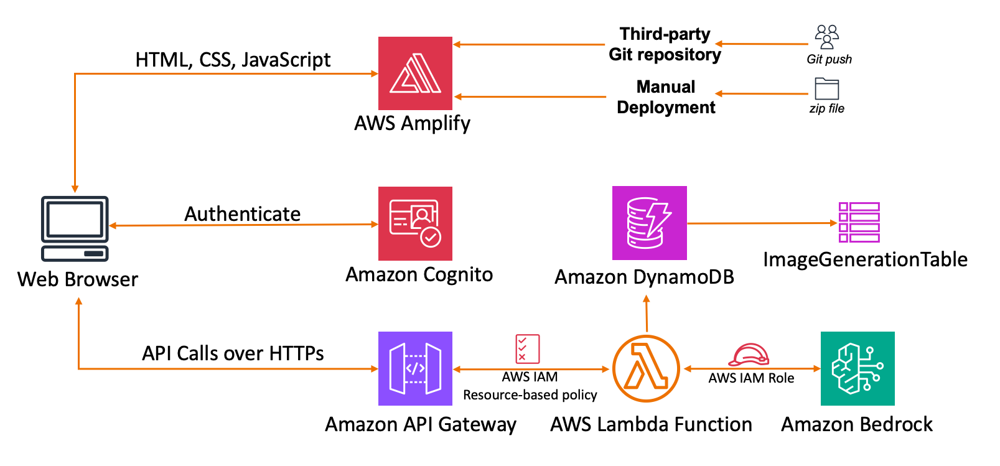
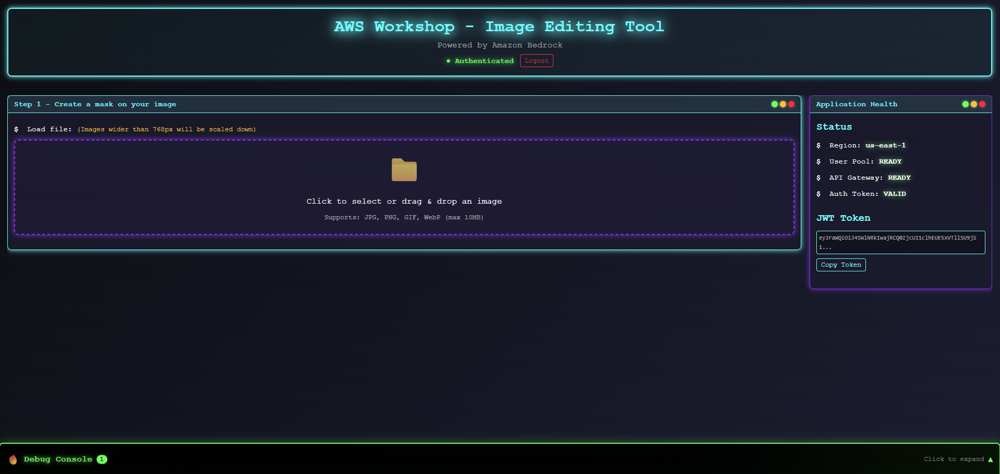
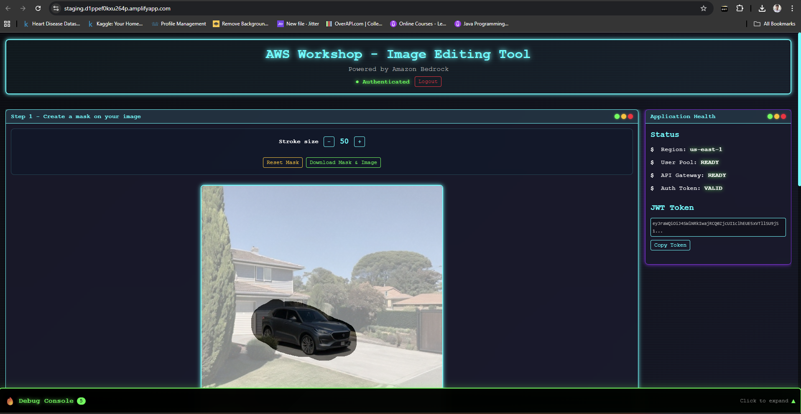
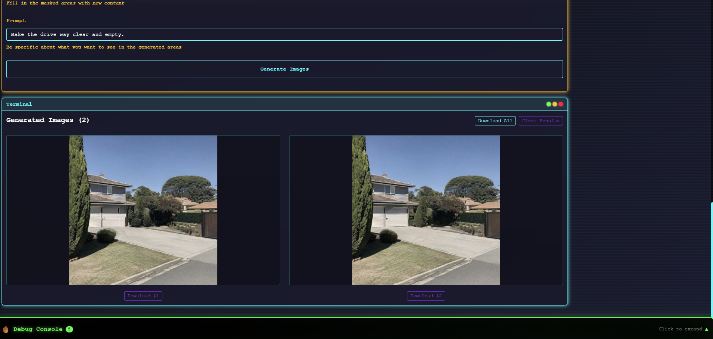

# Image-Editing-Tool

Image-Editing-Tool is a serverless web application that enables users to generate and edit images using Generative AI prompts. The application is built entirely on AWS using managed, scalable services and integrates Amazon Bedrock for AI-powered image generation. This project demonstrates how modern GenAI applications can be built without managing servers or machine learning infrastructure.

---

## 🚀 Features

- AI-powered image generation and editing using text prompts
- Secure user authentication and authorization
- Fully serverless backend architecture
- Scalable REST APIs
- Persistent storage for image metadata and prompts
- Web-based frontend with seamless backend integration

---

## 🧩 Problem Statement

Building AI image editing applications traditionally requires managing servers, scaling infrastructure, and handling complex ML workflows. These challenges increase development time and operational costs, especially for individual developers and small teams.

Image-Editing-Tool addresses this by using a serverless architecture and managed AI services, allowing developers to focus on application logic while AWS handles scalability, security, and reliability.

---

## 🏗️ Architecture Overview

The application follows a cloud-native, serverless architecture using AWS managed services.

### Architecture Flow

1. Users access the application through a web browser.
2. The frontend (HTML, CSS, JavaScript) is hosted on AWS Amplify.
3. Users authenticate securely using Amazon Cognito.
4. The frontend sends API requests over HTTPS to Amazon API Gateway.
5. API Gateway invokes AWS Lambda functions.
6. Lambda interacts with Amazon Bedrock to generate or edit images using AI prompts.
7. Image metadata and request history are stored in Amazon DynamoDB.
8. Generated results are returned to the frontend in real time.

---

## ⚙️ AWS Services Used

- **Amazon Bedrock** – Generative AI image generation (Titan Image Generator G1)
- **AWS Lambda** – Serverless backend logic
- **Amazon API Gateway** – Secure REST APIs
- **Amazon Cognito** – User authentication and authorization
- **Amazon DynamoDB** – Storage for image metadata and prompts
- **AWS Amplify** – Frontend hosting and deployment
- **AWS IAM** – Secure access control and permissions

---

## 🎥 Demo & Screenshots

---

## 📦 Installation & Setup

### Prerequisites

- AWS Account
- Node.js
- AWS CLI configured
- Basic understanding of AWS services

### Setup Steps

1. Clone the repository  
   `git clone https://github.com/your-username/image-editing-tool.git`

2. Deploy backend resources (Lambda, API Gateway, DynamoDB)

3. Create and configure an Amazon Cognito User Pool

4. Assign IAM roles and permissions for Lambda and Bedrock access

5. Update frontend environment variables with API and Cognito details

6. Deploy the frontend using AWS Amplify (Git-based or manual ZIP upload)

---

## 🔐 Security Considerations

- IAM roles follow the principle of least privilege
- Cognito-secured API endpoints
- Resource-based IAM policies for Lambda
- No AWS credentials exposed on the frontend
- HTTPS enforced via API Gateway

---

## 📈 Scalability & Performance

- Automatically scales using AWS Lambda
- Supports concurrent users without manual provisioning
- Pay-as-you-go pricing model
- Future improvements include:
  - API Gateway caching
  - Optimized DynamoDB access patterns
  - Multi-region deployment for high availability

---

## 🧠 Learnings & Takeaways

- Hands-on experience with Amazon Bedrock and Generative AI
- Designing scalable serverless architectures
- Secure authentication using Amazon Cognito
- Integrating GenAI into real-world applications
- Cost-efficient cloud-native application design

---

## 🏆 Context

This project was built during the **AI for Bharat Hackathon – Learning Phase**, focusing on practical implementation of Generative AI using AWS services.

---

## 🔮 Future Enhancements

- Image versioning and history
- Advanced prompt customization
- Support for additional Amazon Bedrock models
- Usage limits and monitoring
- UI enhancements and analytics dashboard

---

## 📄 License

This project is licensed under the MIT License.

---

## 🙌 Acknowledgements

- Amazon Web Services
- Amazon Bedrock
- AI for Bharat Program
